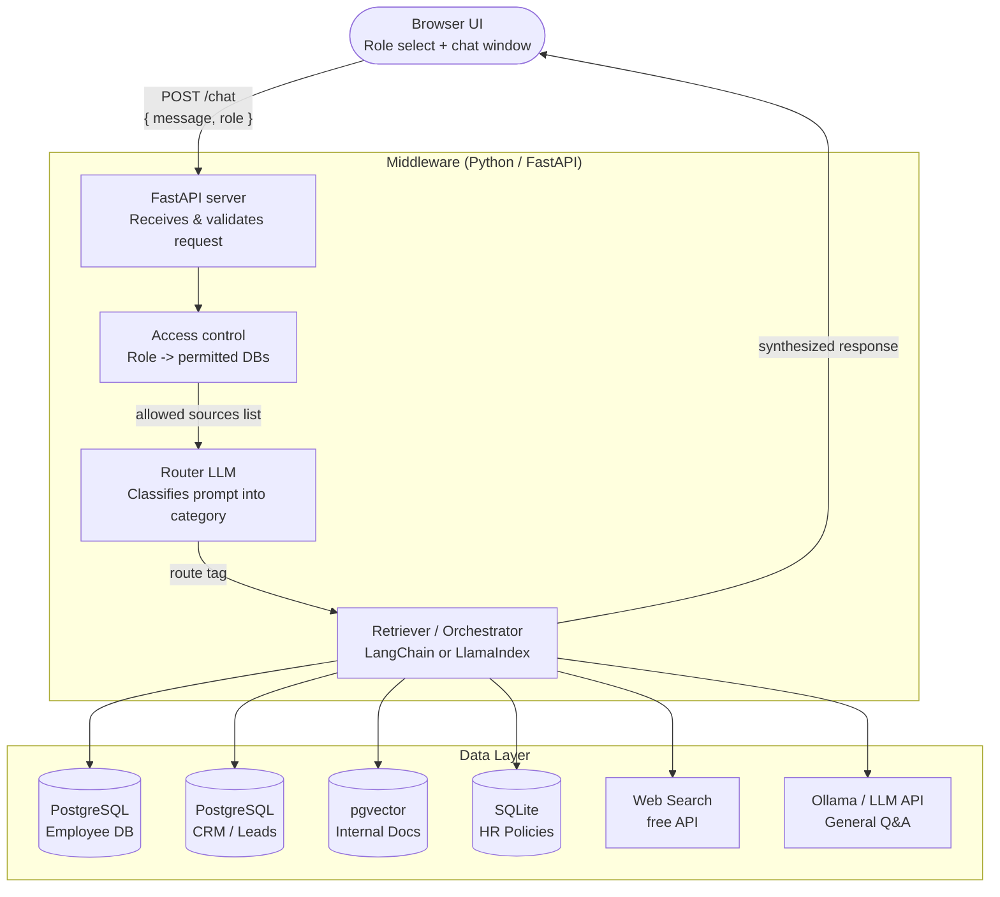

# NexusAI — System Architecture

## Overview

The system is split into three layers: a browser-based frontend, a Python middleware server, and a data layer made up of multiple knowledge bases. A role-aware access control check happens before any data is retrieved, and a router LLM classifies each incoming prompt to decide which source to query.

---

## Architecture Diagram



---

## Component Breakdown

### 1. Frontend — Browser UI (`rag-chatbot-ui.html`)
**Owner:** Zach

The entire UI is a single static HTML file — no framework, no build step. It runs in any browser via `file://` or a simple local server.

- **Screen 1 — Role select:** User picks Manager, Employee, HR, or Admin. Debug mode lets any role be selected without authentication.
- **Screen 2 — Chat:** Classic chat interface. Sends `POST /chat` with `{ message, role }` to the middleware. Displays the response and the route tag (which DB was hit).
- **Handoff point:** Replace the `simulateAIResponse()` stub in `sendMessage()` with a real `fetch()` call.

---

### 2. FastAPI Server — Request intake
**Suggested owner:** backend group member A

A lightweight Python server (`main.py`) with a single `/chat` endpoint.

- Receives `{ message, role }` from the frontend
- Passes it to the access control layer
- Returns `{ reply, route }` back to the frontend
- Holds the LLM API key — **never exposed to the browser**

**Stack:** Python, FastAPI, Uvicorn

---

### 3. Access Control — Role -> permitted sources
**Suggested owner:** backend group member A (alongside FastAPI)

A simple lookup that maps each role to its allowed data sources before the query is dispatched.

| Role | Permitted sources |
|---|---|
| Employee | HR policies, internal docs, web search, general LLM |
| HR | Employee DB, HR policies, internal docs, web search |
| Manager | All of the above + CRM leads, analytics |
| Admin | Everything including audit logs |

The router LLM only sees the sources the role is permitted to use — it cannot route around access control.

---

### 4. Router LLM — Prompt classification
**Suggested owner:** backend group member B

The first LLM call. Takes the user's message and returns a category string.

**Categories:**

| Tag | Trigger example |
|---|---|
| `employee_db` | "What's Sarah's PTO balance?" |
| `crm_leads` | "Show me open deals this quarter" |
| `internal_docs` | "What's the refund policy?" |
| `hr_policies` | "How many sick days do I get?" |
| `web_search` | "What's the current prime rate?" |
| `general_llm` | "Summarize this paragraph for me" |

**Implementation:** A short system prompt instructing the LLM to respond with only one of the category tags. Parse the output and route accordingly.

**Free options:**
- Anthropic API (Claude) — free tier available
- Ollama running Llama 3 locally — fully free, no API key needed

---

### 5. Retriever / Orchestrator — Fetch & synthesize
**Suggested owner:** backend group member B

The core RAG logic. Given a route tag and a query, it:
1. Queries the appropriate data source
2. Retrieves the relevant chunks or records
3. Passes them as context into a second LLM call to generate the final answer

**Stack:** LangChain or LlamaIndex (both free, open source)

---

### 6. Data Layer — Knowledge bases
**Suggested owner:** backend group member C

All databases run locally.

| Source | Technology | Notes |
|---|---|---|
| Employee DB | PostgreSQL | Seeded with fake data via Python Faker |
| CRM / Leads | PostgreSQL | Fake leads table — name, company, stage, value |
| Internal Docs | pgvector (Postgres extension) | PDFs/text chunked and embedded locally |
| HR Policies | SQLite | Simple key-value or structured text |
| Web Search | DuckDuckGo API or SerpAPI free tier | No account needed for DuckDuckGo |
| General LLM | Ollama (local) or Anthropic free tier | Fallback for open-ended questions |

**Claude suggestion for fake data generation:** Use `pip install faker` and a short Python seed script to populate the PostgreSQL tables with realistic employee and lead records.

---

## Data Flow (step by step)

1. User selects a role and types a message in the browser
2. Browser sends `POST /chat { message: "...", role: "manager" }` to `http://127.0.0.1:8000/chat`
3. FastAPI receives the request
4. Access control returns the list of DBs the manager role can query
5. Router LLM reads the message and returns a route tag e.g. `crm_leads`
6. Orchestrator queries the CRM PostgreSQL table with a semantic or SQL search
7. Retrieved context + original message are passed to the response LLM
8. LLM generates a grounded answer
9. `{ reply, route: "crm_leads" }` is returned to the browser
10. Chat window displays the answer and the route tag

---

## Running locally

```bash
# Backend
pip install fastapi uvicorn langchain psycopg2-binary faker chromadb ollama
uvicorn main:app --reload --port 8000

# Frontend
# Just open rag-chatbot-ui.html in your browser
# or: python -m http.server 3000

# Local LLM (optional, replaces API key entirely)
ollama pull llama3
ollama serve
```
